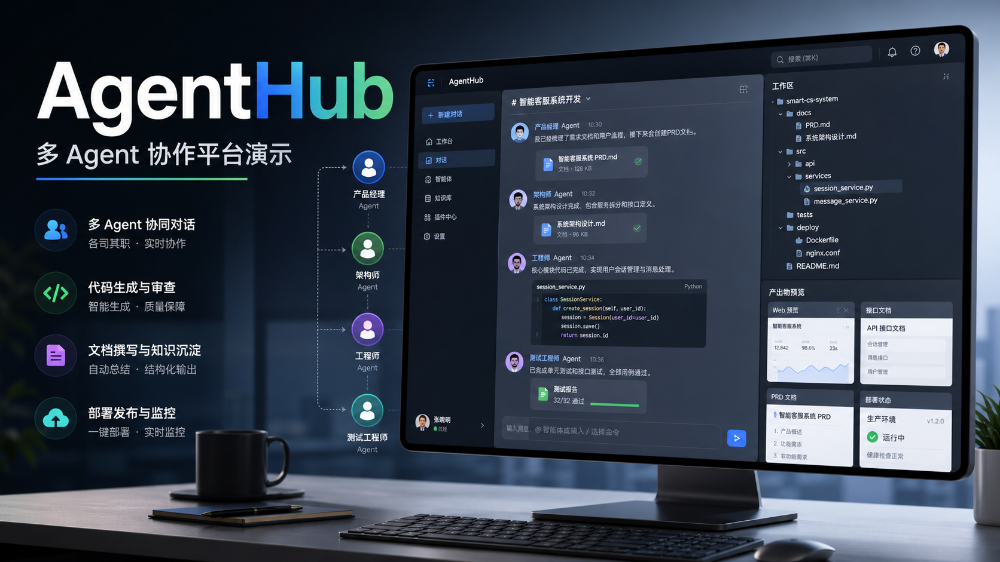

# AgentHub

> 面向真实交付物的 IM 式多 Agent 协作工作台：对话、规划、生成、预览、审阅、修复与部署都在一个界面里完成。

[简体中文](README.md) | [English](README.en.md)

[]()
[]()
[]()
[]()

AgentHub 把 AI 协作做成聊天原生的工作空间。用户可以和单个代码 Agent 对话，也可以让 Orchestrator 把任务拆给多个运行时协作执行，并在同一个产品界面里查看生成文件、预览、部署、工具调用、任务卡片、记忆和上下文。

- 演示站点：[ag.brqs.link](http://ag.brqs.link/login)
- 演示视频：[demo.mp4](demo.mp4)
- API 契约：[shared/openapi.yaml](shared/openapi.yaml)
- AI 协作指南：[AGENTS.md](AGENTS.md)

## 项目亮点与阅读路径

如果想快速了解 AgentHub 做了什么，可以先从下面几条主线看起。每条都对应到可打开的材料，既能看到产品能力，也能顺着链接追到实现细节和验证记录。

### AI 协作不是临时口头约定

AgentHub 不只是把 AI 当成代码生成工具，而是把协作方式沉淀成可以复用的 rules、spec、skill 和日志。任务如何拆、上下文如何传、Agent 失败后如何 fallback、repair loop 怎么收敛、E2E 如何留证据，这些都落到了项目规范和代码路径里。

相关材料：[AGENTS.md](AGENTS.md)、[AI 协作开发记录](docs/ai-collaboration-log.md)、[B2 协作 Skill](docs/ai-skills/b2-ai-collaboration/SKILL.md)、[Orchestrator E2E repair loop Skill](docs/ai-skills/orchestrator-live-e2e-repair-loop/SKILL.md)、[live E2E report spec](docs/b2/spec/orchestrator/live-e2e-report.spec.md)。

### 从一句话到可交付 workspace

产品体验从 IM 开始：用户可以单聊、群聊、@ Agent，也可以让 Orchestrator 自动拆解任务并调度 Claude Code、Codex Helper、OpenCode Helper 协作完成工作。一次请求会逐步变成任务卡片、子 Agent 输出、workspace 文件、artifact manifest、预览、审阅、修复、发布或部署记录。

相关材料：[产品设计](docs/product-design.md)、[API 文档](docs/api-spec.md)、[Orchestrator spec](docs/b2/spec/orchestrator/README.md)、[工作区预览 spec](docs/b2/spec/workspace-artifact-preview.spec.md)，以及 README 后面的“核心能力”和“Orchestrator 执行链路”。

### 产物能预览、能验收、能修

AgentHub 的生成结果不会只停留在聊天文本里，而是落到真实 workspace 文件、Diff、预览卡片、review timeline 和部署记录中。平台把浏览器级质量验收、移动端适配检查、artifact manifest、evaluation/reflection 和 repair loop 串进流程里，让失败结果可以被记录、修复并重新验证。

相关材料：[demo.mp4](demo.mp4)、[预览 spec](docs/b2/spec/workspace-artifact-preview.spec.md)、[evaluation/reflection spec](docs/b2/spec/orchestrator/evaluation-reflection.spec.md)、[deployment release spec](docs/b2/spec/deployment-release-backend.execution.spec.md)、[live E2E report spec](docs/b2/spec/orchestrator/live-e2e-report.spec.md)。

### 架构有清晰解释路径

项目按前后端、服务层、Agent runtime、ModelGateway、workspace、SSE ContentBlock 和数据库状态分层实现。后端用统一 adapter contract 接入不同 Agent runtime，前端用 OpenAPI 生成类型和 SSE 事件渲染结构化过程块，所以可以比较顺地解释消息如何进入系统、任务如何分配、产物如何落盘、状态如何回传。

相关材料：README 的“技术架构”“Agent Runtime 层”“SSE 与 ContentBlock”“数据与状态”章节、[OpenAPI 契约](shared/openapi.yaml)、[API 文档](docs/api-spec.md)、[B2 spec 索引](docs/b2/spec/README.md)。

### 产品感来自过程可见

AgentHub 把多 Agent 协作做成聊天原生工作台，而不是命令行脚本集合。用户能在同一界面看到上下文、任务分工、Agent 接力、产物文件、预览、部署和修复历史；大上下文 Planner、并行 DAG、handoff timeline、task card 归因和 fallback 展示，则让复杂协作过程更容易理解和接管。

相关材料：[task planning spec](docs/b2/spec/orchestrator/task-planning.spec.md)、[message attribution spec](docs/b2/spec/orchestrator/message-attribution.spec.md)、[process block spec](docs/b2/spec/orchestrator/process-block.spec.md)、[deployment handoff spec](docs/frontend/spec/deployment-release-handoff.spec.md)、[产品设计](docs/product-design.md)。

### 交付物索引

- 课题原文：[AgentHub 多 Agent 协作平台设计](<docs/archive/AgentHub- 多Agent协作平台设计.md>)
- 产品设计文档：[docs/product-design.md](docs/product-design.md)
- 技术与接口文档：[docs/api-spec.md](docs/api-spec.md)、[docs/b2/spec/README.md](docs/b2/spec/README.md)、[shared/openapi.yaml](shared/openapi.yaml)
- 可运行 Demo：[ag.brqs.link](http://ag.brqs.link/login)
- AI 协作开发记录：[docs/ai-collaboration-log.md](docs/ai-collaboration-log.md)、[AGENTS.md](AGENTS.md)
- 3 分钟 Demo 视频：[demo.mp4](demo.mp4)

## 演示

[](demo.mp4)

观看或下载完整演示：[demo.mp4](demo.mp4)。

## 核心能力

- **聊天原生的多 Agent 协作**：支持单聊、群聊、Orchestrator 调度、任务卡片、子 Agent 独立消息和 handoff 时间线。
- **真实 workspace 产物**：每个会话都有独立 workspace，支持文件树、代码预览、Diff、上传、artifact manifest 和发布历史。
- **多运行时接入**：内置 Orchestrator、Claude Code、Codex Helper、OpenCode Helper；支持外部 CLI/SDK adapter，以及受限只读 builtin 自建 Agent。
- **Orchestrator 规划与修复闭环**：clarification gate、大上下文 Planner、DAG 执行、并行调度、fallback 可见性、审阅交接、evaluation、reflection 和 repair loop。
- **预览与部署**：支持静态 workspace preview、浏览器级质量验收、静态发布、源码打包和受控容器部署路径。
- **契约驱动开发**：OpenAPI 优先、前端类型生成、后端 adapter contract、spec 与真实 E2E evidence 同步维护。

## 当前内置 Agent

当前 seed 的内置 Agent 只有 4 个：

| Agent | 职责 |
| --- | --- |
| `orchestrator` | 负责群聊协调、任务规划、Agent 调度、平台工具调用和最终总结；不作为普通子任务执行目标。 |
| `codex-helper` | 适合架构判断、仓库理解、总体规划、最终审阅、疑难 bug 和兜底修复。 |
| `claude-code` | 适合实现、文件编辑、代码生成、调试、修复、审阅和 workspace 修改。 |
| `opencode-helper` | 适合 CLI 风格实现、验证、修复和并行执行。 |

自建 Agent 不会按 provider 自动继承这些内置 planning profile。用户自建 external wrapper 会基于某个内置运行时 Agent；用户自建 `builtin` Agent 是受限只读的 Reader/Review Agent，只能暴露 `read_file`。

## 技术架构

### 目录结构

```text
agenthub/
├── backend/                 FastAPI 后端、异步服务、Agent runtime 层
│   ├── app/api/v1/           Auth、会话、stream、agents、uploads、
│   │                         memories、workspaces、shares、events
│   ├── app/agents/           Base adapter contract、外部运行时、
│   │                         builtin runtime、model gateway、orchestrator
│   ├── app/models/           SQLAlchemy models
│   ├── app/schemas/          Pydantic schemas
│   ├── app/services/         Workspace、部署、记忆、平台工具
│   └── alembic/              数据库迁移
├── frontend/                React + Vite 客户端
│   └── src/
│       ├── components/       Chat、agents、artifacts、layout、blocks
│       ├── hooks/            Query 和 streaming hooks
│       ├── lib/              API client、OpenAPI 生成类型、SSE helper
│       ├── pages/            Login、chat、agents、archive、share
│       └── stores/           Zustand stores
├── shared/
│   └── openapi.yaml          API 契约和前端类型源
├── docs/                     产品、架构、spec、协作日志
└── docker-compose.yml        本地 Postgres、Redis、backend、workspace volumes
```

### 后端分层

```text
API layer -> Service layer -> Models/Schemas/Infrastructure
                    |
                    v
              Agent registry -> BaseAgentAdapter implementations
```

关键边界是 `backend/app/agents/base.py`：业务服务通过 registry 和 adapter contract 调用 Agent。原始模型 provider 被收敛在 ModelGateway 层，不作为顶层 Agent 注册。

后端主要模块：

| 模块 | 说明 |
| --- | --- |
| `app/api/v1` | HTTP API、SSE stream、workspace、agent、auth、upload、memory 等入口。 |
| `app/services` | 业务逻辑层，包括 workspace 文件、artifact manifest、deployment、memory、平台工具执行器。 |
| `app/agents` | Agent adapter contract、外部 runtime adapter、builtin runtime、ModelGateway、Orchestrator。 |
| `app/models` | SQLAlchemy async ORM，覆盖用户、会话、消息、Agent、workspace deployment、orchestrator run 记录等。 |
| `app/schemas` | Pydantic v2 schema，是 API、OpenAPI 和前端类型生成的核心来源之一。 |
| `alembic` | 数据库迁移。Compose backend 启动时会执行 `alembic upgrade head`。 |

### Orchestrator 执行链路

典型 Orchestrator 请求会经过以下阶段：

```text
用户消息
-> stream 层构造上下文、workspace、available_agents、memory
-> direct answer / platform facts / clarification gate
-> LLM Planner 或显式 config.tasks
-> task graph 校验、agent 白名单过滤、DAG 依赖分析
-> 并行或顺序调度子 Agent
-> 收集 TaskResult、artifact、tool evidence、child message
-> evaluation / reflection / repair loop
-> preview / browser verify / deployment / source package 等平台工具
-> 最终 process block + 用户可读总结
```

重要规则：

- Planner 只能选择当前群聊可用 Agent，除非 E2E/内部任务显式设置 `available_agents_authoritative=false`。
- Planner 使用专用大上下文路径，默认 `planner_context_max_tokens=128000`，最大可配置到 `1000000`。
- 普通 Orchestrator 主流程上下文默认 `64000 tokens`，子 Agent 分发上下文默认 `64000 tokens`。
- Planner prompt 只保留白名单 memory signals、agent profile 和 recent conversation context，不直接暴露 raw structured memory。
- task card 必须展示实际执行 Agent；发生 fallback 时，run detail/report 保留 `planned/current/final agent` 证据。
- 子 Agent 不负责启动长驻服务；preview、browser verify、部署、源码打包都通过平台 tool 完成。

### Agent Runtime 层

AgentHub 顶层 Agent provider 与底层模型 provider 是分离的：

| 类型 | 说明 |
| --- | --- |
| `claude_code` | Claude Code runtime。默认走 SDK，可配置 CLI fallback。 |
| `codex` | Codex Helper runtime。默认 CLI，可支持 SDK opt-in。 |
| `opencode` | OpenCode CLI runtime，支持本地 auth/state 目录。 |
| `builtin` | 后端内置 AgentLoop + ModelGateway。用户自建 builtin 当前仅允许只读 `read_file`。 |
| `mock` | 测试和开发路径。 |

`ModelGateway` 负责把 Claude / OpenAI-compatible / DeepSeek 等模型后端收敛为统一 stream 接口。它是 builtin agent、direct answer、planner、evaluation 等路径的底层模型访问层。

### SSE 与 ContentBlock

前后端通过 SSE 传输流式事件。核心事件包括：

- `message_start` / `message_done` / `message_error`
- `block_start` / `delta` / `block_end`
- `tool_call` / `tool_result`
- `agent_switch`
- `task_card` / process block / deployment status / artifact references

后端会把执行过程和最终回答拆成结构化 ContentBlock，前端按 block 类型渲染任务卡片、代码、Diff、文件、工具调用、部署状态、review timeline 和最终总结。

### Workspace、预览与部署

- 每个 conversation 对应独立 workspace，生成文件、上传文件、artifact manifest 和发布记录都围绕该 workspace 管理。
- Workspace 文件访问必须经过 path guard，禁止越权读取 `.env`、`.ssh`、secrets、认证目录和平台内部 manifest。
- 静态 preview 由平台 preview service 管理，默认使用 8082 起的端口区间。
- 静态发布通过 `/releases/{release_token}` 暴露不可变快照。
- 源码打包会过滤敏感路径，避免把本地认证状态或密钥打进 zip。
- 容器部署通过受控 worker 执行，Docker 需要 trusted host mode，Podman 可作为 rootless runtime；LLM 不直接拼接 `docker run`。

### 数据与状态

| 存储 | 内容 |
| --- | --- |
| PostgreSQL | 用户、会话、消息、Agent 配置、workspace deployment、orchestrator run/task/attempt/event、memory。 |
| Redis | 缓存、实时/异步辅助能力预留。 |
| `workspaces/` | 会话 workspace 文件。 |
| Docker volumes | Postgres 数据、上传文件、Claude/OpenCode runtime auth state。 |

## 技术栈

| 领域 | 实现 |
| --- | --- |
| 前端 | React 18、Vite、TypeScript、React Router、Tailwind CSS、shadcn 风格组件、Zustand、TanStack Query |
| 流式传输 | 基于 `@microsoft/fetch-event-source` 的 Server-Sent Events |
| 后端 | Python 3.11+、FastAPI、Uvicorn、Pydantic v2、SQLAlchemy 2.0 async |
| 存储 | PostgreSQL 15、Redis 7、本地 workspace 和 upload volumes |
| Agent 运行时 | Claude Agent SDK、Codex adapter、OpenCode CLI adapter、Builtin Agent runtime、ModelGateway |
| 质量保障 | pytest、pytest-asyncio、ruff、mypy、vitest、Testing Library、ESLint、Prettier |
| 客户端 | Web app、Tauri 桌面预留、Capacitor 移动端构建脚本 |

## 快速开始

### 前置要求

- Docker 和 Docker Compose
- Node.js 20+
- pnpm 9+
- 可选：Claude Code、Codex、OpenCode、Anthropic / OpenAI-compatible / DeepSeek 后端所需的 runtime 凭据

### 1. 配置环境变量

```bash
cp .env.example .env
```

本地 smoke run 可以保留默认 Postgres/Redis 配置，只填写你需要的 provider key 或 runtime auth 路径。要执行非 mock Agent，至少需要一个可用 provider/runtime。

常用变量：

| 变量 | 作用 |
| --- | --- |
| `JWT_SECRET` | 登录 token 签名密钥。任何非本地环境都必须替换。 |
| `ANTHROPIC_API_KEY`, `OPENAI_API_KEY`, `DEEPSEEK_API_KEY` | runtime 探活和 ModelGateway 后端使用的 provider 凭据。 |
| `CORS_ORIGINS` | 允许访问后端的前端 origin，默认包含本地 Vite 和 Tauri origin。 |
| `WORKSPACE_BASE_DIR` | 会话 workspace 根目录。 |
| `UPLOAD_STORAGE_DIR` | backend 容器内的持久化上传目录。 |
| `PREVIEW_*` | workspace preview 控制和公网 base URL。 |
| `DEPLOYMENT_CONTAINER_*` | 受控容器部署 runtime、端口和健康检查配置。 |
| `VITE_API_BASE_URL` | 前端 API base URL，默认 `http://localhost:8000`。 |

不要提交真实 `.env`、auth token、runtime state 或 provider key。

### 2. 启动后端服务

```bash
docker compose up -d
```

backend 容器启动时会执行 Alembic migration。需要显式刷新内置 Agent 时：

```bash
docker compose exec backend python -m app.seeds.seed_agents
```

常用本地地址：

- 前端：<http://localhost:5173>
- API 文档：<http://localhost:8000/docs>
- 健康检查：<http://localhost:8000/health>

### 3. 启动前端

```bash
cd frontend
pnpm install
pnpm dev
```

打开 <http://localhost:5173>。

前端可以连接 mock 数据、本地后端或远端后端，取决于 `.env.local`：

```bash
cp .env.example .env.local
# 设置 VITE_USE_MOCK_API=false 可连接真实后端。
# 按需设置 VITE_API_BASE_URL 或 VITE_DEV_PROXY_TARGET。
```

## Runtime 配置检查

seed 的运行时 Agent 依赖容器内可见的 runtime auth：

```bash
docker compose exec backend opencode --version
docker compose exec backend opencode auth list
docker compose exec backend env | grep OPENCODE
```

```bash
docker compose exec backend python -c "import claude_agent_sdk; print('sdk ok')"
docker compose exec backend sh -lc 'ls -la $AGENTHUB_CLAUDE_AUTH_DIR'
docker compose exec backend env | grep -E 'ANTHROPIC|CLAUDE|AGENTHUB_CLAUDE'
```

OpenCode 登录状态通过 `AGENTHUB_OPENCODE_AUTH_DIR` 持久化在 `opencode-state` Docker volume 中。Claude Code 登录状态通过 `AGENTHUB_CLAUDE_AUTH_DIR` 持久化在 `claude-state` Docker volume 中。

## 开发命令

### 后端

```bash
docker compose logs -f backend
docker compose exec backend alembic upgrade head
docker compose exec backend python -m app.seeds.seed_agents
docker compose exec backend pytest
docker compose exec backend ruff check
docker compose exec backend mypy app
```

纯后端本地开发使用 `backend/` 下的 `uv`：

```bash
cd backend
uv venv
uv pip install -e ".[dev]"
uv run pytest
uv run ruff check
uv run mypy app
```

后端测试默认拒绝直接打到开发库。优先使用隔离测试库；如果只是本地一次性确认：

```bash
cd backend
AGENTHUB_ALLOW_DEV_DB_TESTS=1 uv run pytest
```

### 前端

```bash
cd frontend
pnpm gen:types
pnpm test
pnpm lint
pnpm build
```

每次修改 [shared/openapi.yaml](shared/openapi.yaml) 后都要运行 `pnpm gen:types`。生成的类型文件在 [frontend/src/lib/types.gen.ts](frontend/src/lib/types.gen.ts)。

### 桌面与移动端

```bash
cd frontend
pnpm desktop:dev
pnpm tauri:build
pnpm cap:sync
```

这些端需要额外安装对应的本地 native toolchain。

## Live E2E 与 Repair Loop

Live E2E harness 用真实 HTTP/SSE 验证 preview、deployment、多 Agent 规划、fallback 和 repair 行为。

```bash
cd backend
AGENTHUB_E2E_BASE_URL=http://111.229.151.159:8000 \
AGENTHUB_E2E_USERNAME="$AGENTHUB_E2E_USERNAME" \
AGENTHUB_E2E_PASSWORD="$AGENTHUB_E2E_PASSWORD" \
AGENTHUB_E2E_SCENARIO=fullstack_task_manager_parallel_repair_v2 \
uv run python scripts/orchestrator_live_e2e.py
```

近期鲁棒性场景包括：

- `fullstack_task_manager_parallel_repair_v2`
- `cyberpunk_site_quality_repair_8082_v2`
- `im_context_pin_followup_repair`
- `group_chat_attribution_process_matrix`
- `custom_agent_reader_review_repair`
- `static_package_deploy_repair_matrix`
- `group_member_fallback_repair_visibility`
- `im_dialogue_no_artifact_turn_taking_v2`

测试账号密码必须通过环境变量注入。不要把真实账号、密码、access token 或 refresh token 写入源码、报告或日志。

## API 范围

后端 API v1 挂载在 `/api/v1`：

| 领域 | Router |
| --- | --- |
| Auth | `/api/v1/auth` |
| Conversations 和 messages | `/api/v1/conversations`、message routes、`/api/v1/stream` |
| Agents | `/api/v1/agents` |
| Workspaces 和 artifacts | `/api/v1/workspaces` |
| Uploads | `/api/v1/uploads` |
| Memories 和 context compression | `/api/v1/memories`、`/api/v1/context-compression` |
| Realtime events | `/api/v1/events` |
| Local runtime connectors | `/api/v1/local-runtime-connectors` |
| Shares | `/api/v1/conversations/{conversation_id}/shares`、`/api/v1/conversation-shares/{token}` |
| Static releases | `/releases/{release_token}` |

请求和响应细节见 [shared/openapi.yaml](shared/openapi.yaml)，或本地 Swagger UI：<http://localhost:8000/docs>。

## 文档索引

| 需求 | 文档 |
| --- | --- |
| AI 协作规则 | [AGENTS.md](AGENTS.md) |
| 产品设计 | [docs/product-design.md](docs/product-design.md) |
| 技术架构 | [docs/tech-architecture.md](docs/tech-architecture.md) |
| 团队分工 | [docs/team-division.md](docs/team-division.md) |
| API 指南 | [docs/api-spec.md](docs/api-spec.md) |
| Runtime pivot ADR | [docs/spec/agent-runtime-pivot.adr.md](docs/spec/agent-runtime-pivot.adr.md) |
| Agent adapter contract | [docs/b2/spec/agent-runtime-adapter.spec.md](docs/b2/spec/agent-runtime-adapter.spec.md) |
| Builtin Agent framework | [docs/b2/spec/builtin-agent-framework.spec.md](docs/b2/spec/builtin-agent-framework.spec.md) |
| Orchestrator specs | [docs/b2/spec/orchestrator/README.md](docs/b2/spec/orchestrator/README.md) |
| Workspace sandbox | [docs/b1/spec/workspace-sandbox.spec.md](docs/b1/spec/workspace-sandbox.spec.md) |

## 协作规则

本仓库是契约驱动的。改代码前请先读 [AGENTS.md](AGENTS.md)。简版规则：

- API 变更从 [shared/openapi.yaml](shared/openapi.yaml) 开始，然后同步 schema、service、route 和前端类型。
- 后端服务通过 `agents.registry.get_adapter(...)` 调用 Agent，不直接 import 具体外部 runtime。
- Agent adapter 实现 BaseAgentAdapter v2 contract，不访问数据库。
- ContentBlock 变更必须同步 backend schema、OpenAPI 和前端渲染器。
- 保持所有权边界清晰：`frontend/**`、后端 core/services/API、`backend/app/agents/**` 分属不同模块。

## 仓库状态

AgentHub 仍处于 MVP 阶段，runtime、workspace、deployment 和 Orchestrator 能力都在快速迭代。部分文档可能描述计划中或刚 pivot 的行为；如果不确定，以当前代码、[shared/openapi.yaml](shared/openapi.yaml) 和 [AGENTS.md](AGENTS.md) 为准。

## License

当前仓库尚未提供 license 文件。
