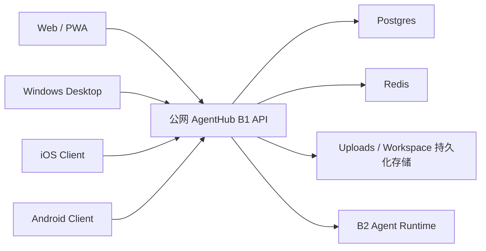

# AgentHub 远程后端接入与多端共享会话路线

## 1. 目标

本路线统一 Web、Windows Desktop、iOS 和 Android 的联网模型：

- 客户端可以连接本地 AgentHub，也可以连接用户选择的公网 AgentHub。
- 同一用户在不同平台登录同一公网后端后，看到相同的会话、消息、Agent、Workspace 元数据和记忆。
- 客户端不维护第二份业务数据库，也不实现点对点消息同步。
- Agent、Orchestrator、模型、Skills、MCP 和外部 runtime 始终由当前连接的后端调度。

这是一套标准 C/S 架构。共享事实保存在服务端，客户端只保存连接偏好、当前后端对应的登录态和可丢弃的界面缓存。



## 2. 核心设计原则

1. **后端是事实源**：会话和消息以服务端持久化结果为准。
2. **连接显式可见**：用户知道当前连接的是本地还是公网后端。
3. **账号按后端隔离**：不同后端的 JWT 不混用，不把本地 token 发给公网服务器。
4. **切换必须收敛**：切换后端时清空 Query、会话、Agent 和 stream 等易失缓存，再加载目标后端数据。
5. **HTTPS 优先，HTTP 可显式连接**：公网生产推荐 HTTPS；桌面客户端允许用户显式保存和探测 HTTP 远程后端，用于内网、测试机或临时部署，并在 UI 中提示明文传输风险。
6. **不伪造同步**：P1 不增加客户端同步引擎、离线合并或冲突解决。
7. **运行环境归后端**：连接公网后端时使用公网后端可用的 Claude、Codex、OpenCode、MCP 和模型账号。

## 3. P0：远程后端接入

### 3.1 后端档案

桌面端保存一组后端档案：

```ts
type BackendProfile = {
  id: string
  name: string
  url: string
  mode: "local" | "remote"
  serverId?: string
  lastConnectedAt?: string
  lastHealth?: "ready" | "unreachable" | "incompatible"
}
```

默认保留 `http://localhost:8000` 本地档案。用户可以添加公网 HTTPS 地址，也可以显式添加 HTTP 地址用于内网或临时测试，测试连接并切换。远程模式隐藏本地 Docker 控制和“打开本机 Workspace 文件夹”等不成立的操作。

### 3.2 服务端身份与能力

公开接口：

`GET /api/v1/server-info`

返回非敏感信息：

- 稳定的 `server_id`
- 服务端版本
- `local | hosted` 部署类型
- uploads、workspace、orchestrator、desktop local stack 等能力
- JWT 认证类型
- 上传大小上限

客户端先检查 `/health`，再读取 `/api/v1/server-info`。旧后端没有该接口时仍可兼容连接，但不会获得完整身份和能力信息。

### 3.3 登录态隔离

认证存储键包含规范化后的 backend URL。切换档案后：

1. 停止并清理当前 active streams。
2. 清空 Query Client、Agent store 和 Chat store。
3. 切换 REST 与 SSE 共用的 runtime base URL。
4. 恢复目标后端自己的 JWT 和用户信息。
5. 未登录目标后端时进入其登录页。

任何时候都不能把 A 后端的 token 自动带到 B 后端。

## 4. P1：多端共享会话

### 4.1 数据模型

P1 复用现有服务端模型，不新增客户端同步表：

- `users`：账号身份
- `conversations`：用户拥有或可见的会话
- `messages`：消息和 stream 终态
- `agents`：内置与自定义 Agent
- `workspaces` / uploads：会话产物
- memory 表：继续由记忆模块维护，不由连接层直接修改

同一账号连接同一 `server_id` 时，客户端通过现有列表和详情 API 获取相同数据。

### 4.2 刷新与一致性

P1 采用服务端最终一致、客户端轻缓存：

- 应用启动和重新登录时 hydrate 会话列表。
- 窗口重新获得焦点时 refetch stale query，吸收其它设备的新状态。
- SSE 仅负责当前客户端订阅的实时输出。
- 服务端 `done/error` 终态覆盖本地临时状态。
- 切换后端不保留另一个后端的 optimistic message。

未来需要真正的跨设备即时通知时，可以增加 WebSocket 或推送事件总线；P1 不提前引入这套复杂度。

### 4.3 公网部署契约

公网 AgentHub 必须满足：

- `AGENTHUB_DEPLOYMENT_MODE=hosted`
- 设置稳定且唯一的 `AGENTHUB_SERVER_ID`
- 使用长期稳定的 JWT secret；重启不能导致所有客户端随机失效
- Postgres、uploads、workspaces 和必要 runtime state 使用持久化卷或外部托管存储
- Redis 按现有 stream/锁语义部署
- 对外只暴露 HTTPS，反向代理正确转发 SSE 且禁用响应缓冲
- CORS 允许正式 Web origin 和 `http://tauri.localhost`
- 数据库、uploads 和 workspaces 有备份与恢复演练
- 多实例部署前确认进程内 stream manager 的限制，避免把同一 stream 随机路由到不同实例

### 4.4 文件与 Workspace

共享的是后端可访问的文件事实，不是桌面主机目录：

- Web、移动端和桌面端都通过 B1 uploads / workspace API 访问内容。
- 远程模式不允许 Tauri 根据 conversation ID 打开本机目录。
- 公网多实例部署必须使用所有实例都能访问的持久化文件存储。
- 文件上传与记忆模块通过已有 attachment / asset 元数据对齐；连接层不直接写记忆。

## 5. F / B1 / B2 分工

### F

- 后端档案管理、连接测试和当前连接展示。
- REST/SSE 使用同一个 runtime base URL。
- token 按后端隔离。
- 切换时清理易失状态。
- 聚焦 refetch 和服务端 hydrate。

### B1

- 提供 `/health` 和 `/api/v1/server-info`。
- 认证、用户隔离、会话、消息、Workspace 和 uploads 是共享事实源。
- 公网部署负责持久化、备份、SSE 代理和 CORS。

### B2

- 只运行当前后端实际可用的模型、Agent、Skills 和 MCP。
- 不因为客户端是桌面端而切换到用户本机 runtime。
- runtime health 和凭据继续保留在后端，不返回给客户端。

## 6. 验收

### P0

- 桌面端可保存本地与公网后端档案。
- HTTPS 远程地址可以探测和保存；HTTP 远程地址也可以显式保存和探测，但 UI 必须提示明文连接风险。
- 切换后端后 REST 与 SSE 同步切换。
- A/B 后端登录态互不覆盖。
- 本地旧版单一 `backendUrl` 偏好可迁移为默认档案。

### P1

- 用户在 Web 和 Desktop 登录同一公网账号后看到相同会话。
- 设备 A 创建会话或完成消息后，设备 B 重新聚焦可看到服务端状态。
- 切换到另一台后端时不出现上一台后端的会话残影。
- 公网后端重启后数据仍存在。
- 远程会话使用远程 B2 runtime，不误调用桌面主机 runtime。

## 7. 后续阶段

- P2：refresh token、设备会话管理和远程注销。
- P2：跨设备实时会话事件，不依赖窗口聚焦刷新。
- P2：服务端对象存储和上传断点续传。
- P3：团队空间、共享会话权限和审计。
- P3：本机 runtime connector，作为独立且显式授权的能力，不混入远程后端连接。
