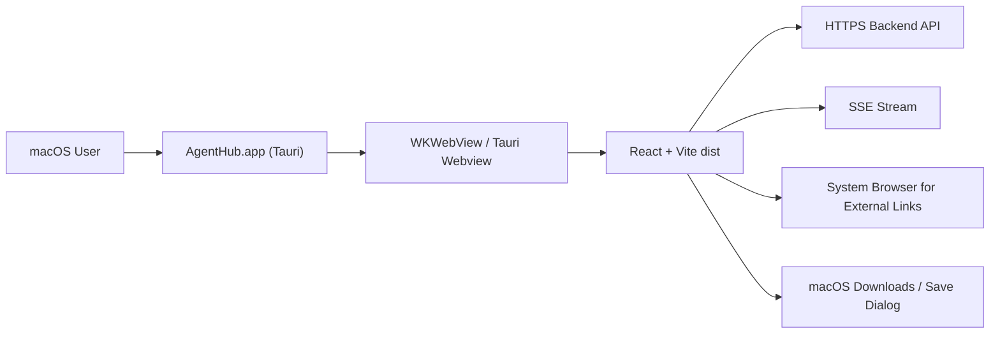

# Frontend macOS Tauri Shell Spec

## 1. 背景

AgentHub 当前前端是 React + Vite SPA，已经支持 Web、PWA 与 iOS / Android Capacitor 壳层。项目架构文档明确桌面端使用 Tauri 包装同一份 `frontend/dist/`，移动端使用 Capacitor。macOS 客户端目标是“薄壳”：复用现有 Web 产品能力，不复制聊天、Workspace、Agent 管理或部署发布业务逻辑。

本 spec 面向 macOS 第一版桌面客户端。Windows / Linux 可复用 Tauri 基础工程，但不进入本轮验收。

## 2. 目标

1. 使用 Tauri v2 包装 `frontend/dist/`，产出可在 macOS 运行的 `.app` 和 `.dmg`。
2. 复用现有真实 API、JWT、SSE、Workspace、Artifact、文件上传和部署发布前端能力。
3. 提供桌面端基础体验：固定窗口尺寸、系统菜单、外链用系统浏览器打开、下载/预览路径可控、Dock/窗口标题正确。
4. 保持 Web / Capacitor / Tauri 三端共享 React 业务代码，平台差异集中在 `nativeShell` 或新增 `desktopShell` 适配层。
5. 明确签名、公证、自动更新的后续边界，MVP 可先做本地未签名构建。

## 3. 非目标

- 不把后端、数据库、Agent runtime 内嵌进 Mac 客户端。
- 不做离线模式、本地消息缓存、本地 Agent 执行或本地 workspace 同步。
- 不引入 Electron，除非后续 Tauri 因 WebView/SSE/下载限制被证明不可用。
- 不在 Mac 客户端中绕过后端鉴权、CORS、文件安全扫描或 workspace API。
- 不为 macOS 单独 fork React 页面。

## 4. 技术选型

### 4.1 采用 Tauri v2

原因：

- 项目 `docs/tech-architecture.md` 已规划桌面端用 Tauri 包装 `dist/`。
- 相比 Electron，Tauri 包体更小，系统 WebView 更贴近“套壳”需求。
- Tauri v2 有权限模型、bundle、macOS 签名/公证、deep link、opener/updater 等官方能力。
- 当前前端已将原生差异集中在 `frontend/src/lib/nativeShell.ts`，适合扩展为跨 Capacitor / Tauri 的 Shell 层。

### 4.2 暂不采用 Capacitor Desktop

Capacitor 当前项目中用于 iOS / Android，Mac 桌面分发、菜单、签名、公证、自动更新生态不如 Tauri 路线清晰。桌面壳不应继续堆在 Capacitor 配置里。

### 4.3 暂不采用 Electron

Electron 可行但不优先：包体大、运行时成本高、安全面更大。只有当 Tauri 的 WebView 在 SSE、文件下载、企业代理环境中出现无法接受的限制时再评估。

## 5. 输入 / 输出

输入：

- `frontend/dist/`
- `frontend/package.json`
- `frontend/src/lib/api.ts`
- `frontend/src/lib/env.ts`
- `frontend/src/lib/nativeShell.ts`
- `frontend/public/icons/*`
- 构建变量 `VITE_API_BASE_URL`

输出：

- `frontend/src-tauri/`
- Tauri 配置：`frontend/src-tauri/tauri.conf.json`
- Tauri Rust 入口：`frontend/src-tauri/src/main.rs`
- Tauri capabilities：`frontend/src-tauri/capabilities/default.json`
- 前端 Shell 适配：`frontend/src/lib/shell.ts` 或扩展 `nativeShell.ts`
- package scripts：`tauri:dev`、`tauri:build`、`build:desktop`
- macOS bundle：`.app`、`.dmg`

## 6. 架构



原则：

- Tauri 只负责壳层能力：窗口、菜单、外链、文件系统下载、系统通知、更新。
- REST/SSE 仍由浏览器端 `axios` / `fetch-event-source` 访问后端。
- 后端不区分 Mac 客户端业务逻辑，只可通过 `client_platform=desktop` 做日志、上传来源或诊断。
- 所有平台共享 ContentBlock、Workspace、Agent、Deployment 的 UI 组件。

## 7. 前端实现方案

### 7.1 依赖

新增开发依赖：

```json
{
  "@tauri-apps/cli": "^2",
  "@tauri-apps/api": "^2"
}
```

按需新增插件：

- `@tauri-apps/plugin-opener`：打开外链、文件 URL。
- `@tauri-apps/plugin-dialog`：保存文件、选择目录。
- `@tauri-apps/plugin-fs`：MVP 后如需安全下载到本地文件再启用。
- `@tauri-apps/plugin-updater`：P2 自动更新。
- `@tauri-apps/plugin-deep-link`：P2 自定义协议或 universal link。

### 7.2 package scripts

新增脚本：

```json
{
  "build:desktop": "tsc -b && vite build",
  "tauri:dev": "tauri dev",
  "tauri:build": "pnpm build:desktop && tauri build"
}
```

说明：

- `tauri dev` 可使用 Vite dev server。
- `tauri build` 必须先生成 `dist/`。
- 不复用 `build:native`，因为该脚本含 Capacitor HTTPS 守卫文案和移动端语义。

### 7.3 Tauri 初始化

在 `frontend/` 下执行：

```bash
pnpm add -D @tauri-apps/cli
pnpm add @tauri-apps/api
pnpm tauri init
```

建议配置：

```json
{
  "productName": "AgentHub",
  "version": "../package.json",
  "identifier": "com.agenthub.desktop",
  "build": {
    "beforeDevCommand": "pnpm dev",
    "devUrl": "http://localhost:5173",
    "beforeBuildCommand": "pnpm build:desktop",
    "frontendDist": "../dist"
  },
  "app": {
    "windows": [
      {
        "title": "AgentHub",
        "width": 1280,
        "height": 860,
        "minWidth": 1024,
        "minHeight": 720,
        "resizable": true,
        "fullscreen": false
      }
    ],
    "security": {
      "csp": null
    }
  },
  "bundle": {
    "active": true,
    "targets": ["app", "dmg"],
    "icon": [
      "icons/32x32.png",
      "icons/128x128.png",
      "icons/128x128@2x.png",
      "icons/icon.icns"
    ],
    "macOS": {
      "minimumSystemVersion": "12.0"
    }
  }
}
```

CSP 说明：MVP 可先保留 `null` 以降低集成风险，但 P1 必须收紧到允许当前 API、SSE、图片/文件预览和部署预览域名的策略。

### 7.4 Shell 抽象

当前已有 `nativeShell.ts` 处理 Capacitor：

- `initializeNativeShell`
- `openExternalUrl`
- `handleExternalLink`
- Android back button

Mac 客户端应改造成平台无关 Shell：

```ts
export type ShellPlatform = 'web' | 'capacitor' | 'tauri';

export function getShellPlatform(): ShellPlatform;
export function initializeShell(): void;
export async function openExternalUrl(url: string): Promise<void>;
export function handleExternalLink(event: React.MouseEvent<HTMLAnchorElement>, url?: string | null): void;
```

平台判断：

- Capacitor：`Capacitor.isNativePlatform()`
- Tauri：`Boolean(window.__TAURI_INTERNALS__)` 或动态 import `@tauri-apps/api/core`
- Web：默认

外链策略：

- Web：`window.open(url, '_blank', 'noopener,noreferrer')`
- Capacitor：`Browser.open({ url })`
- Tauri：`@tauri-apps/plugin-opener.openUrl(url)`

### 7.5 API Base URL

Mac 客户端必须使用完整后端地址：

```bash
VITE_API_BASE_URL=https://api.example.com pnpm tauri:build
```

规则：

- 生产 Mac 构建必须是 HTTPS。
- 本地开发可允许 `http://127.0.0.1:8000` 或 `http://111.229.151.159:8000`，但必须通过显式变量开启：

```bash
VITE_ALLOW_INSECURE_DESKTOP_API=true
```

需要扩展 `env.ts`：

- Capacitor 继续使用现有 `VITE_ALLOW_INSECURE_NATIVE_API`。
- Tauri 新增 `VITE_ALLOW_INSECURE_DESKTOP_API`。
- 错误文案区分移动原生壳与桌面壳。

### 7.6 登录与 Session

沿用现有 JWT local storage/session storage 策略。

验收点：

- Mac 客户端登录成功后刷新窗口仍保持登录。
- 401 时仍执行 `resetClientSession()` 并跳转 `/login`。
- 不在 Tauri Rust 层存储 token。
- 后续如需系统 Keychain，另开 P2 spec。

### 7.7 SSE

沿用 `@microsoft/fetch-event-source`。

验收点：

- Mac 客户端发送消息后可收到流式 text / process / tool / file / deployment block。
- 窗口失焦、最小化、恢复后 SSE 不出现重复 stream 或 token 丢失。
- 网络断开时展示现有 offline/recovery UI。

### 7.8 文件上传

MVP 复用现有 Web 上传能力：

- 点击文件选择。
- 拖拽上传。
- 粘贴图片。
- multipart 上传到后端。

Mac 差异：

- 可拖拽 Finder 文件到 MessageInput。
- 不在 Tauri Rust 层直接读取任意路径，除非用户通过 file picker 或 drop 授权。
- `client_platform` 传 `desktop`，用于后端日志和上传诊断。

P1 增强：

- 使用 Tauri dialog 提供“选择文件/目录”。
- 下载 artifact 时弹出保存位置。
- 大文件下载走 Rust sidecar / fs plugin 时必须有权限 scope。

### 7.9 Workspace 预览与下载

MVP：

- Workspace 文件树、代码高亮、全屏预览、修改模式沿用 Web。
- 外部部署 URL 用系统浏览器打开。
- Blob 下载沿用 Web 实现。

P1：

- source zip / artifact 下载使用 save dialog。
- 下载失败展示具体错误：权限、网络、文件名非法、路径不可写。

### 7.10 macOS UI 适配

MVP 保持 Web 桌面布局，但需检查：

- 顶部 header 不需要移动端 safe-area padding。
- 右侧 workspace 可拖拽宽度在 Mac 窗口下合理。
- 最小窗口 `1024x720` 下不出现横向溢出。
- 深色/浅色模式跟随现有主题，不强制跟随系统。

P1 可增加：

- macOS 标准菜单：AgentHub / Edit / View / Window / Help。
- `Cmd+,` 打开设置。
- `Cmd+K` 聚焦搜索或命令入口。
- `Cmd+N` 新建会话。
- `Cmd+R` 刷新当前视图但不丢失 SSE 状态。

## 8. 后端配合

MVP 后端原则上不需要新增业务接口。

需要确认/配置：

1. CORS 允许 Tauri origin。
   - Tauri 生产环境可能表现为自定义 scheme / local origin，而 API 直连 HTTPS 后端时仍会触发浏览器 CORS。
   - 后端 CORS 需要允许 Mac 客户端实际 origin，或在 Tauri 端使用 `https://` remote origin 策略。
2. 上传接口支持 `client_platform=desktop`。
   - 现有 file upload spec 已有 `web | ios | android | desktop`。
3. 下载/预览 URL 必须是 Mac WebView 可访问的 HTTPS URL。
4. SSE 端点保持标准 HTTP streaming，不依赖浏览器特有代理。
5. 生产环境必须支持 HTTPS，不能要求 Mac 客户端访问纯 HTTP。

不需要后端做：

- 不需要专门的 Mac 登录接口。
- 不需要返回 Electron/Tauri 专用消息格式。
- 不需要后端感知窗口、菜单、Dock 或更新逻辑。

## 9. 安全要求

Tauri 权限最小化：

- 默认不开放 shell 执行。
- 默认不开放全盘文件系统读取。
- opener 仅允许打开 http/https/mailto 等安全外链。
- fs/dialog 只用于用户显式选择和保存路径。
- 不允许前端传入任意本地路径给 Rust 层读取。
- 不把 JWT 写入 Rust 日志或系统日志。

CSP / allowlist：

- P1 收紧 CSP。
- 外链点击必须经过 URL 校验。
- `file://` 不作为远程内容预览入口。

签名与公证：

- 本地开发可使用未签名 app。
- 对外分发必须使用 Apple Developer ID 签名并 notarize。
- CI 中不得明文保存 Apple ID 密码、证书私钥或 notarization 凭据。

## 10. 打包发布

### 10.1 本地开发

```bash
cd frontend
VITE_API_BASE_URL=http://127.0.0.1:8000 \
VITE_ALLOW_INSECURE_DESKTOP_API=true \
pnpm tauri:dev
```

### 10.2 本地打包

```bash
cd frontend
VITE_API_BASE_URL=https://api.example.com pnpm tauri:build
```

产物：

- `frontend/src-tauri/target/release/bundle/macos/AgentHub.app`
- `frontend/src-tauri/target/release/bundle/dmg/AgentHub_*.dmg`

### 10.3 签名与公证

P1 / Release Candidate：

- 配置 Apple Developer ID Application 证书。
- 配置 `APPLE_SIGNING_IDENTITY`。
- 配置 notarization credentials。
- 构建 `.dmg` 后执行 notarization 并 staple。

### 10.4 自动更新

P2：

- 引入 Tauri updater plugin。
- 更新 manifest 放在可信 HTTPS 域名。
- 更新包必须签名。
- 更新失败不能阻塞用户继续使用当前版本。

## 11. 验收标准

### P0 MVP

- `pnpm tauri:dev` 能打开 AgentHub Mac 窗口。
- `pnpm tauri:build` 能生成 `.app` 和 `.dmg`。
- Mac 客户端可登录真实后端。
- 会话列表、消息加载、SSE 流式回复可用。
- Workspace 文件树、代码预览、文件修改、全屏预览可用。
- Agent 管理、自定义 Agent、knowledge/skill 上传展示可用。
- 文件上传至少支持点击选择、拖拽、粘贴图片。
- 外链、部署 URL、artifact URL 使用系统浏览器打开。
- 退出重开后登录态按现有策略恢复。
- 最小窗口下无主要内容横向溢出。

### P1 产品化

- macOS 菜单和常用快捷键可用。
- 下载弹出保存位置。
- CORS / CSP / opener / fs 权限收紧。
- `.dmg` 签名和 notarization 路线跑通。
- 增加 Mac 客户端 smoke 测试文档。

### P2 分发增强

- 自动更新。
- Deep link：`agenthub://chat/{conversation_id}`。
- 系统通知：长任务完成、部署完成、需要用户确认。
- Keychain 存储 token。
- crash/log 采集与用户可导出诊断包。

## 12. 测试计划

单元测试：

- Shell 平台识别。
- `openExternalUrl` 在 Web / Capacitor / Tauri 下分发正确。
- `env.ts` 对 desktop HTTP/HTTPS 守卫正确。

集成测试：

- Mac dev shell 登录、发送消息、SSE 接收。
- Workspace 文件选择、预览、修改、保存。
- 文件上传 PC 桌面三路径：选择、拖拽、粘贴。
- 部署 URL 打开系统浏览器。

手工验收矩阵：

| 场景 | 本地 dev | 打包 app | 备注 |
| --- | --- | --- | --- |
| 登录 / 401 跳转 | required | required | 真实后端 |
| SSE 流式回复 | required | required | 最小化恢复 |
| Workspace 代码预览 | required | required | 大文件降级 |
| 文件上传 | required | required | 图片 / md / zip |
| 外链打开 | required | required | 系统浏览器 |
| 下载 | optional | required | P1 save dialog |
| 深浅色 | required | required | 跟随现有主题 |
| 最小窗口 | required | required | 1024x720 |

## 13. 实施步骤

1. 新增 Tauri 依赖和 scripts。
2. 初始化 `src-tauri/`，配置 app id、窗口、bundle icon。
3. 抽象 `nativeShell.ts` 为跨 Web / Capacitor / Tauri shell。
4. 增加 desktop env 守卫。
5. 接入 opener plugin，替换外链打开路径。
6. 本地 `tauri dev` smoke。
7. `tauri build` 生成 `.app` / `.dmg`。
8. 补单元测试和 Mac 验收文档。
9. P1 再处理签名、公证、CSP、保存文件对话框。

## 14. 风险与决策点

| 风险 | 影响 | 处理 |
| --- | --- | --- |
| 后端 CORS 不允许 Tauri origin | Mac 客户端登录/API 失败 | 提前记录实际 Origin 并配置后端 |
| HTTP 后端在生产不可用 | 打包后 network error | 生产强制 HTTPS |
| WebView 下载行为不一致 | artifact/source zip 保存失败 | P1 引入 dialog/fs |
| 签名/公证缺 Apple Developer 账号 | 用户安装被 Gatekeeper 阻拦 | MVP 本地测试，发布前补签名 |
| Tauri 权限过宽 | 安全面扩大 | capabilities 最小化 |
| 与 Capacitor shell 判断冲突 | 移动端回归 | Shell 抽象加测试 |

## 15. 相关文档

- `docs/tech-architecture.md`：跨平台策略，桌面端使用 Tauri。
- `docs/frontend/spec/frontend-capacitor-shell.spec.md`：移动原生壳边界。
- `docs/frontend/spec/frontend-file-upload.spec.md`：上传在 Web / iOS / Android / desktop 的平台字段。
- `docs/spec/next-major-modules.spec.md`：跨平台和上传后续模块规划。
- `frontend/src/lib/nativeShell.ts`：现有原生壳差异入口。
