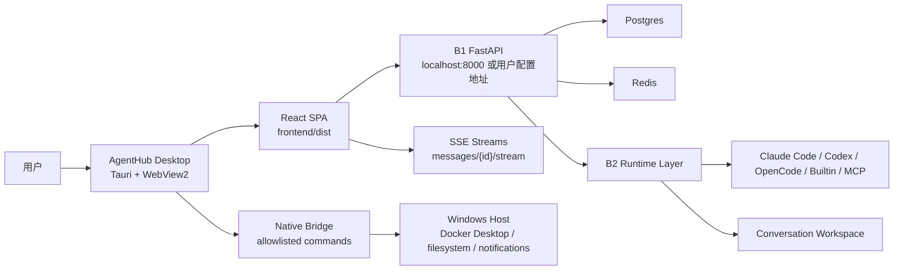

# AgentHub Windows Desktop Client Spec

> Status: Draft architecture spec
> Last updated: 2026-06-09
> Scope: Windows desktop wrapper, local AgentHub stack integration, and native capability boundary
> Owners: F + B1 + B2

## 1. Summary

AgentHub Windows 桌面客户端第一版采用 **Tauri + WebView2 网页套壳**。客户端复用现有 React Web 产品面，不重写聊天、Workspace、服务器 Agent 套壳构建器、SSE、Orchestrator 或文件上传业务逻辑。

桌面壳的职责是：

- 启动和承载现有 `frontend/dist/`；
- 发现并连接本机 AgentHub 后端；
- 在用户明确授权下管理本机开发栈；
- 提供少量原生能力，例如通知、打开文件夹、选择文件、查看日志；
- 保持 Agent Runtime 的事实源仍在 B1/B2 后端。

核心判断：

- 可以用网页套壳实现 Windows 桌面客户端。
- 可以使用当前运行环境下的 Agent，但必须通过 AgentHub 后端调度，不能让前端或壳层直接绕过后端调用 Claude / Codex / OpenCode / MCP。
- 可以让客户端操作当前主机，但只能通过白名单原生桥接命令，并且涉及文件、进程、Docker、外部程序和凭据时必须有权限边界与用户确认。

## 2. Product Goals

### 2.1 用户目标

- 双击桌面图标即可进入 AgentHub，不需要记住 `localhost` 端口。
- 继续使用 Web 端已有会话、Workspace、Agent、模型账号和运行时状态。
- 后端未启动时，客户端给出清晰状态与一键启动入口。
- Docker、后端、Redis、Postgres、Agent runtime 失败时，用户看到可诊断信息，而不是空白页。
- 可从桌面客户端打开当前会话 Workspace 文件夹、下载产物、收到任务完成通知。
- 可通过 GitHub Releases 分发安装包，并通过 Tauri signed updater 在客户端内更新桌面壳。

### 2.2 工程目标

- React 仍是唯一产品 UI 事实源。
- Tauri 壳层只做平台能力，不复制业务逻辑。
- 后端仍是 Agent 调度、权限、Workspace、记忆、模型账号、MCP 的唯一事实源。
- 所有主机操作都经过显式能力清单、参数校验、审计日志和必要确认。
- 不引入 Electron 级别的重运行时开销，MVP 优先使用 Tauri + Windows WebView2。

### 2.3 非目标

- 不做一个独立于 Web 的 Windows 原生 UI。
- 不让前端直接读取任意本机文件或执行任意 shell。
- 不把 Docker / Postgres / runtime state 静默重置。
- 不把用户宿主机 Claude / Codex 登录态自动复制进项目。
- 不在桌面壳中实现另一个 Agent runtime。

## 3. Architecture

### 3.1 分层职责

| Layer | 职责 | 不应该做 |
|---|---|---|
| React SPA | 聊天、服务器 Agent 套壳构建器、Workspace、设置页、SSE 客户端 | 直接执行本机命令 |
| Tauri Shell | 窗口、菜单、通知、桥接命令、启动体验 | 复制 React 业务状态 |
| B1 Backend | API、会话、消息、Workspace、权限、DB、Stream lifecycle | 相信前端传来的权限判断 |
| B2 Runtime | Adapter、模型网关、Orchestrator、MCP、external runtime | 读取壳层本地状态作为事实源 |
| Docker Stack | Postgres、Redis、Backend、runtime 依赖 | 保存未加密密钥到 repo |

### 3.2 推荐运行模式

#### Mode A: Connect Existing Stack

桌面客户端只连接已有本地后端：

- 用户或批处理脚本已经启动 Docker stack；
- Tauri 启动后检查 `http://localhost:8000/health`；
- 健康后加载 React；
- 不主动管理 Docker。

这是 MVP 的最低风险模式。

#### Mode B: Managed Local Stack

桌面客户端可以启动和停止本地 AgentHub stack：

- 检测 Docker Desktop 是否运行；
- 调用项目内受控脚本或 `docker compose up -d`；
- 轮询 backend health；
- 显示启动日志与故障原因；
- 不执行用户输入的任意命令。

这是 Windows 用户体验的主路线，但需要更完整的安全边界。

#### Mode C: Bundled Installer

安装包内包含桌面壳、Web dist、版本清单、启动脚本和文档：

- Docker Desktop 仍作为外部依赖；
- 或后续探索嵌入式轻量后端包；
- 支持更新检查、迁移提示和日志打包。

这是 P2/P3，不作为第一版阻塞项。

## 4. Reusing Current Agents

桌面客户端“使用当前运行环境下的 Agent”的正确路径是：

1. React 通过现有 API 读取 Agent 列表、conversation、runtime availability。
2. 用户在桌面客户端发送消息。
3. B1 创建 user message 和 agent message。
4. B1/B2 根据当前 conversation 成员、runtime health、模型账号、权限与 Workspace 状态调度 Agent。
5. React 订阅 SSE 并展示结果。

桌面壳不能直接调用：

- `claude` CLI；
- Codex CLI；
- OpenCode CLI；
- MCP stdio command；
- Python runtime adapter；
- 数据库或 workspace 私有路径。

这样做的原因：

- 当前项目已经在 B1/B2 内实现了 group-scoped dispatch、retry、interrupt、queued turn、Workspace、权限和错误持久化；
- 绕过后端会破坏会话一致性和审计；
- 直接调用本机 CLI 会把认证、权限、日志、工作目录隔离问题重新引入前端。

## 5. Desktop UX Contract

### 5.1 启动状态

桌面启动时显示一个轻量启动页，而不是白屏：

- `正在检查 AgentHub 后端...`
- `正在启动本地服务...`
- `Docker Desktop 未运行`
- `端口被占用`
- `后端启动失败，查看日志`
- `连接远程 AgentHub`

启动页属于壳层/React bootstrap 的共同体验，但状态事实来自 Tauri bridge + backend health。

### 5.2 设置页

设置页增加“桌面客户端”分组：

- 后端地址：本地 `http://localhost:8000` / 自定义远程地址；
- 本地服务状态：Postgres、Redis、Backend；
- Docker 状态；
- 日志入口；
- Workspace 打开方式；
- 通知开关；
- 诊断包导出。

语言设置、自定义 Agent 套壳与 Skills 管理仍使用现有 Web 设置，不因为桌面壳另起一套。

### 5.3 Workspace

桌面客户端可以提供“在文件资源管理器中打开 Workspace”能力，但必须遵守：

- 只能打开后端返回的当前 conversation workspace；
- 不能让前端传任意路径；
- 路径必须经过后端或 Tauri bridge 双重校验；
- 打开文件夹是用户显式点击动作。

Workspace 文件读写仍通过 B1 API 和 B2 runtime 权限完成。

### 5.4 通知

允许桌面通知：

- 长任务完成；
- 任务失败；
- 等待用户确认；
- 需要登录 runtime；
- 后台服务断开。

通知点击回到对应 conversation。通知不展示密钥、完整 stderr、私有文件内容。

### 5.5 安装与更新

P4 的用户路径：

1. 首次安装：下载并运行 `AgentHub_Desktop_{version}_x64-setup.exe`。
2. 日常更新：客户端设置页自动或手动检查 GitHub Releases 的 `latest.json`。
3. 安装更新：Tauri updater 验证签名后下载更新包并安装，重启后生效。
4. 回滚：用户手动安装上一版本安装包。

安全边界：

- updater artifact 必须签名，不能关闭签名校验。
- updater private key 只存在 CI secret，不进入 repo、安装包或诊断包。
- Windows 代码签名是发行层增强；没有证书时不改变 updater 签名要求。
- 安装器、更新器和卸载器都不得静默删除 Docker volumes、Workspace、uploads、Postgres/Redis 数据或 Claude/OpenCode/Codex auth state。
- 桌面客户端只更新自身，不自动升级 Docker Desktop、不重建 backend image、不迁移用户项目目录。

Release artifacts:

- `AgentHub_Desktop_{version}_x64-setup.exe`
- `AgentHub_Desktop_{version}_x64_en-US.msi`
- `latest.json`
- signed updater package and `.sig`
- `checksums.txt`

## 6. Native Capability Boundary

桌面壳提供的是 **受控能力**，不是“浏览器获得主机权限”。

允许能力：

- 检查 backend health；
- 启动/停止受控 compose stack；
- 读取受控服务日志尾部；
- 打开当前 workspace 文件夹；
- 选择文件并交给现有上传 API；
- 保存下载文件；
- 打开外部 URL；
- 发送系统通知。

禁止能力：

- 任意 shell；
- 任意路径读写；
- 任意 Docker volume 修改；
- 任意环境变量读取；
- 读取或复制 Claude / Codex / OpenCode 登录态；
- 直接调用 Agent runtime；
- 后台静默上传本机文件。

详细桥接契约见 [windows-desktop-host-bridge.spec.md](windows-desktop-host-bridge.spec.md)。

## 7. Data And State

### 7.1 会话数据

桌面客户端不创建独立会话数据库。所有会话数据仍在后端 Postgres。

本地状态只保存：

- 桌面窗口大小；
- 最近使用的 backend URL；
- 是否启用通知；
- 是否自动启动本地 stack；
- 语言设置等 UI preference。

### 7.2 运行时状态

Claude / Codex / OpenCode / MCP 的认证事实源仍由后端配置决定：

- `.env` provider key；
- Docker named volume；
- AgentHub model accounts；
- B2 runtime health check。

桌面壳最多展示诊断结果，不成为 runtime credential store。

### 7.3 Workspace 数据

Workspace 仍由 B1 `WorkspaceService` 管理：

- `settings.workspace_base_dir / conversation_id`；
- tree/file/deployment API；
- runtime cwd/dir 约束；
- archive safe extraction；
- file upload import confirmation。

桌面壳不直接扫描 workspace 来构建 UI。

## 8. Security Principles

1. **后端是权限事实源**：前端和壳层显示权限，但 B1/B2 执行时再次校验。
2. **最小主机能力**：每个 Tauri command 都有固定名字、固定参数 schema、固定允许路径。
3. **显式用户确认**：启动服务、停止服务、打开文件夹、导出日志、选择文件都来自点击。
4. **无任意命令**：MVP 不提供“在桌面壳执行命令”的通用接口。
5. **凭据不可见**：bridge 不返回完整 env、API key、auth json、token。
6. **可审计**：主机操作写入本地 audit log，方便用户和开发者排障。
7. **可回退**：桌面壳失败时，Web `localhost:5173` / `localhost:8000` 仍可继续使用。

## 9. Compatibility

### 9.1 Windows

MVP 目标：

- Windows 10/11；
- WebView2 runtime；
- Docker Desktop；
- PowerShell；
- 当前 repo 的 `docker compose` 本地开发栈。

### 9.2 macOS / Linux

架构上不阻断后续跨平台，但本 spec 的命令、路径、安装器、日志位置以 Windows 为主。

### 9.3 Remote Backend

桌面客户端可连接远程 AgentHub，但此时：

- 本地 stack 管理不可用；
- 打开本地 workspace 文件夹不可用；
- 原生上传/下载、通知仍可用；
- Agent runtime 使用远程后端环境，不是本机环境。

## 10. Acceptance Criteria

- Windows 桌面客户端可以加载现有 React UI。
- 后端已运行时，登录、会话、Agent 列表、发送消息、SSE、Workspace 与 Web 端一致。
- 后端未运行时，不白屏，能解释原因并提供启动/重试入口。
- 不存在任意 shell 或任意路径读写 bridge。
- 当前运行环境中的 Agent 通过 B1/B2 正常调度，而不是由 Tauri 直接调用。
- 同一账号在 Web 与桌面看到同一 DB 中的会话与 Agent。
- 桌面特有失败不会污染 Web 端状态。

## 11. Related Docs

- [windows-desktop-host-bridge.spec.md](windows-desktop-host-bridge.spec.md)
- [windows-desktop-implementation-plan.md](windows-desktop-implementation-plan.md)
- [windows-desktop-test-plan.md](windows-desktop-test-plan.md)
- [../../architecture/remote-backend-shared-sessions-roadmap.md](../../architecture/remote-backend-shared-sessions-roadmap.md)
- [frontend-capacitor-shell.spec.md](frontend-capacitor-shell.spec.md)
- [frontend-file-upload.spec.md](frontend-file-upload.spec.md)
- [../../tech-architecture.md](../../tech-architecture.md)

## 12. Remote Backend Profiles

- Desktop 可以保存多个本地或远程 AgentHub 连接档案。
- 非回环远程地址必须使用 HTTPS。
- 每个后端拥有独立的 JWT 本地存储分区。
- 切换档案时必须先清理 Query、Chat、Agent 和 active stream，再恢复目标后端登录态。
- `/health` 用于就绪探测，`/api/v1/server-info` 用于读取服务端身份、部署模式与能力。
- 同一账号连接同一公网后端时，共享会话来自同一服务端数据库，不由桌面客户端执行点对点同步。
- Remote 模式下本地 Docker 管理和打开本机 Workspace 文件夹不可用；Agent runtime 使用远程后端环境。
